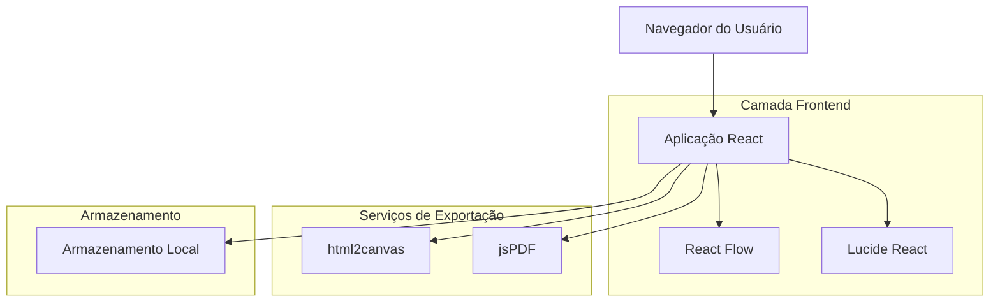

## 1. Arquitetura do Sistema



## 2. Stack Tecnológica

- **Frontend**: React@18 + Vite + TypeScript
- **Estilização**: Tailwind CSS@3
- **Biblioteca de Diagramas**: React Flow@11
- **Ícones**: Lucide React
- **Exportação PDF**: jsPDF + html2canvas
- **Testes**: Vitest + React Testing Library
- **Ferramenta de Inicialização**: vite-init

## 3. Definições de Rotas

| Rota | Finalidade |
|------|------------|
| / | Página principal com canvas de edição |
| /export | Página de exportação com pré-visualização |
| /about | Página informativa sobre a aplicação |

## 4. Estrutura de Componentes

### 4.1 Componentes Principais

```typescript
// Tipos principais
interface OrganogramNode {
  id: string;
  type: 'manager' | 'coordinator' | 'sector';
  position: { x: number; y: number };
  data: {
    title: string;
    description?: string;
    color: string;
    shape: 'rectangle' | 'rounded' | 'circle';
  };
}

interface OrganogramEdge {
  id: string;
  source: string;
  target: string;
  type: 'hierarchical';
}

interface OrganogramData {
  nodes: OrganogramNode[];
  edges: OrganogramEdge[];
}
```

### 4.2 Componentes React

```typescript
// Componente principal do canvas
<OrganogramCanvas />
  - Gerencia estado do React Flow
  - Renderiza nodes customizados
  - Handle drag-and-drop
  - Controles de zoom e pan

// Toolbar de ferramentas
<Toolbar />
  - Botões de adicionar nodes
  - Seletor de cores e formas
  - Controles undo/redo

// Painel de propriedades
<PropertyPanel />
  - Editar texto e cores do node selecionado
  - Ajustar tamanho e forma
  - Configurações de estilo

// Componentes de exportação
<ExportPreview />
  - Visualização do organograma
  - Opções de formatação
  - Botões de download
```

## 5. Armazenamento Local

```typescript
// Estrutura de dados no localStorage
interface LocalStorageData {
  organograms: {
    [id: string]: {
      name: string;
      data: OrganogramData;
      createdAt: string;
      updatedAt: string;
    }
  };
  settings: {
    theme: 'light' | 'dark';
    defaultNodeColor: string;
    autoSave: boolean;
  };
}
```

## 6. Funcionalidades de Exportação

### 6.1 Exportação PDF
- Biblioteca: jsPDF
- Qualidade: 300 DPI para impressão profissional
- Orientações: Retrato e Paisagem
- Tamanhos: A4, A3, Letter
- Preservação de vetores via SVG

### 6.2 Exportação SVG
- SVG puro com estilos inline
- Texto como elementos text (editável)
- Grupos organizados por hierarquia
- ViewBox automático baseado no conteúdo

### 6.3 Impressão Direta
- CSS print media queries
- Ocultar UI em modo impressão
- Ajustar cores para preto e branco
- Escala automática para caber na página

## 7. Testes

### 7.1 Testes Unitários
```typescript
// Exemplos de testes
- Renderização de componentes
- Adição e remoção de nodes
- Validação de dados de entrada
- Cálculos de posicionamento
- Conversão de cores e formatos
```

### 7.2 Testes de Integração
```typescript
// Fluxos completos
- Criar organograma do zero
- Editar propriedades existentes
- Exportar para diferentes formatos
- Persistência no localStorage
- Responsividade em diferentes tamanhos
```

## 8. Performance e Otimização

### 8.1 Virtualização
- Renderizar apenas nodes visíveis
- Uso de React.memo para evitar re-renders
- Debounce em operações de arrasto

### 8.2 Bundle Size
- Code splitting por rotas
- Import dinâmico de bibliotecas grandes
- Tree shaking no build

### 8.3 Memória
- Limpar event listeners ao desmontar
- Gerenciar referências circulares
- Evitar memory leaks no localStorage

## 9. Tratamento de Erros

### 9.1 Validações
- Limite máximo de nodes (1000)
- Texto máximo por node (200 caracteres)
- Validação de cores hexadecimais
- Prevenção de loops na hierarquia

### 9.2 Mensagens de Erro
- Feedback visual para ações inválidas
- Notificações toast para erros
- Logs detalhados em modo desenvolvimento
- Recovery automático